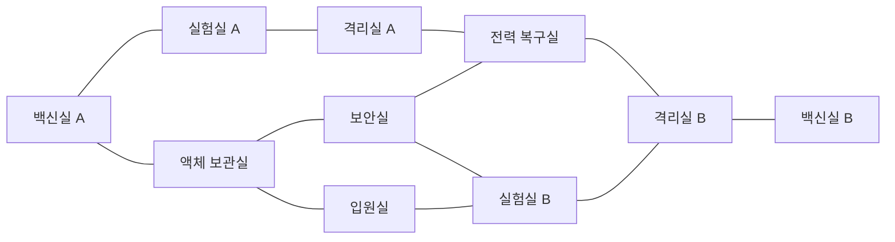

# 맵·레벨 설계서

> 문서 버전: 1.5
> 기준 GDD: 1.1
> 맵: 정전된 생명공학 연구소 1층

---

## 1. 레벨 목표

이 맵은 다음 상황을 반복해서 만들어야 한다.

- 플레이어가 빠른 길과 안전한 우회로 사이에서 선택한다.
- 소리가 난 방으로 괴물이 모이지만 완전히 피할 수 없는 막힘은 적다.
- 빌런이 스피커로 특정 구역의 위험을 높일 수 있다.
- 강화 현장과 제어 위치가 떨어져 동선 추리가 발생한다.
- 백신실과 정보 시설을 오가는 과정에서 해독제 선점과 목격이 발생한다.
- 프로젝트 진행에 따라 같은 공간의 밝기와 정보량이 달라진다.

---

## 2. 전체 구조

방 10개를 북측 루프, 남측 루프와 중앙 연결로 구성한다.

선은 직접 붙은 문이 아니라 플레이 가능한 복도 연결을 의미한다.
위 12개 연결 외의 방 사이에는 통행 가능한 복도를 만들지 않는다.

### 2.1 설계 효과

- 백신실 A–실험실 A–격리실 A와 액체 보관실–보안실을 잇는 북측 순환 경로가 있다.
- 액체 보관실–입원실–실험실 B와 보안실–전력 복구실–격리실 B를 잇는 남측 우회 경로가 있다.
- 중앙 통로가 위험하면 외곽으로 우회할 수 있다.
- 백신실 A/B 사이의 이동이 길어 해독제 위치 선택이 중요하다.
- 격리실 A/B는 서로 반대편에 있어 개체 강화가 맵 전체 압박으로 이어진다.
- 백신실 B는 격리실 B를 통해서만 진입하는 위험한 종단 방이다.

---

## 3. 초기 공간 기준

| 항목 | 그레이박스 시작값 |
| --- | --- |
| 복도 폭 | 4.5m |
| 주요 교차로 폭 | 6~7m |
| 일반 문 폭 | 4.5m |
| 격리실 문 폭 | 4.5m 이상 |
| 작은 방 | 약 9×9m |
| 중형 방 | 약 12×15m |
| 대형 방 | 약 15×18m |
| 맵 반대편 이동 | 플레이어 기준 30~45초 |
| 한 루프 순환 | 플레이어 기준 50~70초 |
| 긴 직선 시야 | 최대 약 12m 후 차폐물 배치 |
| 벽 단면 두께 | 0.2~0.35m |

수치는 실제 Unity 캐릭터 크기와 카메라에서 테스트한 뒤 조정한다.

---

## 4. 방별 설계

### 4.1 백신실 A

- 권장 위치: 북서
- 크기: 12×15m
- 핵심 오브젝트: 제작기, 지정 보관함, 약품 냉장고, 독성 강화 스테이션
- 출입구: 두 개
- 단서: 빈 주사기 1단계 위치
- 시야: 중앙 실험대가 직선 시야를 끊음
- 위험: 외곽 방이지만 실험실 A와 보관실에서 괴물이 접근 가능

### 4.2 실험실 A

- 권장 위치: 북중앙
- 크기: 15×18m
- 핵심 오브젝트: 시료 분류, 보고서, 후각 강화 스테이션, 환풍구
- 출입구: 두 개
- 단서: 붉은 연기 1단계 위치
- 특징: 맵에서 가장 많이 목격되는 강화 현장 중 하나

### 4.3 격리실 A

- 권장 위치: 북동
- 크기: 12×15m
- 핵심 오브젝트: 강화 유리 우리, 잠금문, 추가 괴물 스폰 2개
- 출입구: 실험실 A·전력 복구실 방향 두 개
- 단서: 개방된 격리문과 파손 표시
- 주의: 막다른 공간처럼 보이지만 전력실 쪽 우회 복도 확보

### 4.4 액체 보관실

- 권장 위치: 서중앙
- 크기: 12×15m
- 핵심 오브젝트: 냉장 탱크, 레시피 후보 지점, 시료 운반 미션
- 출입구: 세 개
- 특징: 북·남 루프를 잇는 외곽 연결
- 시각: 청록색 냉기와 낮은 안개, 이동 가독성을 해치지 않음

### 4.5 보안실

- 권장 위치: 중앙
- 크기: 15×18m
- 핵심 오브젝트: CCTV 월, 전자지도, 서버 로그, 격리실 제어 패널
- 출입구: 세 개
- 특징: 가장 많은 동선이 교차하는 정보 허브
- 위험: 정보 UI 사용 중 캐릭터가 정지하므로 목격과 호위가 중요
- 엄폐: 서버 랙으로 시야를 나누되 입구는 확인 가능

### 4.6 전력 복구실

- 권장 위치: 동중앙
- 크기: 12×15m
- 핵심 오브젝트: 퓨즈, 차단기, 비상 배터리, 격리 제어 보조 패널
- 출입구: 세 개
- 특징: 미션 실패 소음이 자주 발생하는 고위험 방
- 단서: 격리실 B 제어와 연결될 수 있는 정황

### 4.7 입원실

- 권장 위치: 남서
- 크기: 12×15m
- 핵심 오브젝트: 침대, 커튼, 의료 단말, 레시피 후보 지점
- 출입구: 두 개
- 특징: 커튼이 시야를 분절해 공포와 매복감을 만들지만 충돌은 단순해야 함
- 표현: 혈흔은 직접적 고어보다 환경 서사 수준으로 제한

### 4.8 실험실 B

- 권장 위치: 남중앙
- 크기: 15×18m
- 핵심 오브젝트: 시료 패키징, 서버 백업, 후각 강화 스테이션
- 출입구: 세 개
- 단서: 붉은 연기 2단계 위치
- 특징: 남측 주요 교차점이며 백신실 B 접근 통로

### 4.9 격리실 B

- 권장 위치: 남동
- 크기: 12×15m
- 핵심 오브젝트: 두 번째 괴물 스폰 2개, 격리문
- 출입구: 세 개의 복도 연결 중 두 개는 방 앞에서 갈라지도록 구성
- 단서: 두 번째 개체 강화 흔적

### 4.10 백신실 B

- 권장 위치: 남측 외곽
- 크기: 12×15m
- 핵심 오브젝트: 제작기, 보관함, 독성 강화 스테이션
- 출입구: 한 개
- 단서: 빈 주사기 2단계 위치
- 특징: 백신실 A와 멀고 격리실 B를 통해서만 접근하는 고위험 종단 방

---

## 5. 복도와 교차로

### 5.1 복도 원칙

- 캐릭터 두 명과 괴물 한 마리가 엇갈릴 수 있는 폭을 확보한다.
- 방 사이 연결은 축 정렬 직각 복도로 만들고 대각선 복도는 사용하지 않는다.
- 12개 복도는 고정 경로를 사용하며 다른 방의 바닥이나 벽을 관통하지 않는다.
- 굴절점은 복도 폭과 같은 정사각형 조인트로 메운다.
- 충돌 벽은 방과 복도 조각마다 만들지 않고 전체 이동 가능 바닥의 외곽선에만 생성한다.
- 문 바로 앞에 큰 장식물을 두지 않는다.
- 8마리 상태에서도 경로가 한 문에 집중되지 않도록 평행 연결을 둔다.
- 모든 긴 복도에는 적어도 하나의 옆방, 굴절 또는 시야 차폐물이 있다.
- 기둥과 큰 프롭은 캐릭터 실루엣을 완전히 가리지 않는 높이와 형태로 그린다.

### 5.2 중앙 교차로

- 보안실 주변은 최소 세 방향을 한 화면에서 판단할 수 있다.
- 완전한 안전지대가 되지 않도록 CCTV 사용 지점은 입구에서 약간 안쪽에 둔다.
- 프로젝트 25% 이전에도 유도등으로 출구 방향을 구분할 수 있어야 한다.

---

## 6. 시작 위치

### 6.1 플레이어

6개 시작점은 다음 후보에 분산한다.

- 액체 보관실 앞 복도
- 실험실 A 앞 복도
- 전력 복구실 앞 복도
- 입원실 앞 복도
- 실험실 B 앞 복도
- 보안실 외곽 교차로

역할에 따라 시작 위치를 바꾸지 않는다. 모든 시작점은 첫 미션까지 최소 하나 이상의 합리적 경로를 가진다.

### 6.2 초기 괴물

- 북측 외곽 복도 1
- 동측 외곽 복도 1
- 남측 외곽 복도 1
- 서측 외곽 복도 1

시작 30초 동안 순찰만 하며 플레이어를 추격하지 않는다. 플레이어 시작점에서 바로 보이는 위치는 피한다.

### 6.3 추가 괴물

- 격리실 A 내부 2개
- 격리실 B 내부 2개

활성화 전에 3초간 경보등과 문 개방 애니메이션을 재생한다.

---

## 7. 미션과 레시피 배치

### 7.1 미션 스테이션 수

| 계열 | 최소 스테이션 |
| --- | ---: |
| 전력 | 4 |
| 보안 | 3 |
| 탈출·신호 | 3 |
| 실험실 보안 | 6 |
| 빌런 강화 | 6 |

한 오브젝트가 여러 미션 변형을 제공할 수 있다. 시각적으로는 정상 미션과 빌런 위장 미션을 구분하기 어렵게 만든다.

### 7.2 레시피 후보

- 액체 보관실 선반 2곳
- 입원실 의료 기록 2곳
- 실험실 A 서류함 1곳
- 실험실 B 서류함 1곳
- 전력실 정비 기록 1곳
- 보안실 서버 캐비닛 1곳

라운드마다 생존자 5명의 개인 레시피를 서로 다른 후보에 배치한다. 백신실 내부에는 레시피를 두지 않는다.

---

## 8. 스피커·CCTV·로그 배치

### 8.1 스피커

- 모든 주요 방에 한 개씩
- 긴 복도 교차점에 최대 두 개 추가
- 스피커는 벽 단면 또는 바닥 가장자리에 배치하고 LED는 탑다운에서 보이게 한다.
- 방별 식별 코드를 표시해 회의에서 위치를 말하기 쉽게 한다.

### 8.2 CCTV

- 북측 루프 복도
- 남측 루프 복도
- 중앙 교차로
- 백신실 A/B 앞
- 격리실 A/B 앞

방 내부 전체를 감시하지 않는다. 강화 행동이 CCTV에 직접 찍히기보다 전후 동선을 보여주는 용도다.

### 8.3 서버 로그

출입 센서는 각 방의 주요 문에 둔다. 장식용 문과 내부 파티션은 로그를 만들지 않는다.

---

## 9. 조명 단계

### 9.1 0%

- 비상구 표시, 컴퓨터, 바닥 유도등만 활성화
- 손전등 중심
- 주요 상호작용 오브젝트는 약한 자체 발광 표시

### 9.2 25%

- 중앙과 각 루프의 바닥 유도등·벽 표시등 일부 점등
- 방 이름 표지판 선명화
- 완전한 안전감을 주지 않도록 깜박임과 어두운 구간 유지

### 9.3 50%

- CCTV, 지도, 보안실 모니터 활성화
- 정보 단말 주변 조명 점등

### 9.4 75%

- 탈출 경로의 유도등 활성화
- 남은 미션 구역을 전자지도에 표시

### 9.5 100%

- 비상문과 옥상 방향 조명 점등
- 승리 연출로 전환

---

## 10. 카메라와 가림 처리

- XY 평면을 수직으로 보는 직교 투영 카메라를 사용한다.
- 카메라 회전은 제공하지 않는다.
- 천장과 전면 벽은 그리지 않고 벽 단면으로 방 경계를 표시한다.
- 큰 프롭은 캐릭터를 완전히 덮지 않도록 낮은 형태 또는 반투명 상부 레이어로 제작한다.
- CCTV는 별도 직교 카메라 또는 저빈도 위치 스냅샷으로 표시한다.

---

## 11. 2D 경로 그래프와 충돌

- 플레이어와 괴물은 `Collider2D`로 같은 벽 경계를 사용하되 충돌 반경을 다르게 둔다.
- 괴물은 방 중심·문·복도 굴절점으로 구성한 2D 웨이포인트 그래프를 사용한다.
- 가구 아래와 장식 틈은 경로 그래프에 연결하지 않는다.
- 자동문은 열림 상태에서 해당 그래프 연결을 활성화한다.
- 문 충돌은 서버 판정과 클라이언트 표시가 일치해야 한다.
- 좁은 문 앞에 괴물 대기 지점을 여러 개 둬 겹침을 줄인다.
- 추가 괴물 생성 위치는 유효 웨이포인트에서 충분히 떨어진 개별 지점으로 둔다.

---

## 12. 그레이박스 검증 기준

- 모든 방 이름을 5초 안에 식별할 수 있다.
- 어느 방에서도 두 개 이상의 탈출 방향을 찾을 수 있다. 격리실 내부는 예외다.
- 맵 반대편까지 정상 이동이 25~35초다.
- 플레이어가 괴물 한 마리를 시야와 코너를 이용해 피할 수 있다.
- 괴물 8마리 상태에서 모든 주요 통로가 동시에 완전히 막히지 않는다.
- 스피커를 켰을 때 목표 방으로 적어도 한 마리 이상 유도되는 상황이 자주 발생한다.
- 백신실 두 곳의 이동 선택에 실질적인 차이가 있다.
- 보안실이 지나치게 안전하거나 필수 병목이 되지 않는다.
- 탑다운 화면에서 벽 단면과 프롭이 플레이어·단서를 가리지 않는다.

아트 작업은 이 기준을 통과한 그레이박스 레이아웃을 기준으로 시작한다.
