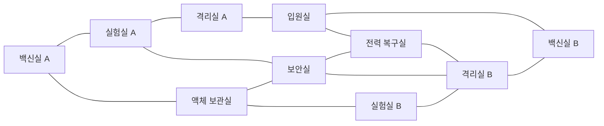

# 맵·레벨 설계서

> 문서 버전: 1.15
> 기준 GDD: 1.5
> 맵: 정전된 생명공학 연구소 1층

---

## 1. 레벨 목표

이 맵은 다음 상황을 반복해서 만들어야 한다.

- 플레이어가 빠른 길과 안전한 우회로 사이에서 선택한다.
- 소리가 난 방으로 괴물이 모이지만 완전히 피할 수 없는 막힘은 적다.
- 빌런이 스피커로 특정 구역의 위험을 높일 수 있다.
- 강화 현장과 제어 위치가 떨어져 동선 추리가 발생한다.
- 백신실과 정보 시설을 오가는 과정에서 해독제 선점과 목격이 발생한다.
- 프로젝트 진행에 따라 같은 공간의 밝기와 정보량이 달라진다.

---

## 2. 전체 구조

방 10개를 중앙 보안 광장, 북측 시설 띠, 서측 외곽로, 남측 부두형 루프와
동측 긴 뒷골목으로 구성한다. 중앙에서 빠르게 가로지를 수 있지만 바깥쪽을 돌아
추격을 끊을 수 있는 다중 순환형 구조다.

선은 직접 붙은 문이 아니라 플레이 가능한 복도 연결을 의미한다.
위 14개 연결 외의 방 사이에는 통행 가능한 복도를 만들지 않는다.

### 2.1 설계 효과

- 보안실은 네 방향이 열리는 중앙 광장으로 가장 빠르지만 가장 쉽게 목격되는 지름길이다.
- 백신실 A–실험실 A–보안실–액체 보관실은 짧은 서측 순환로를 만든다.
- 액체 보관실–실험실 B–격리실 B–보안실은 남측 부두형 순환로를 만든다.
- 격리실 A–입원실–전력실은 북동쪽 시설 띠와 중앙 광장을 연결한다.
- 격리실 B–백신실 B의 긴 동측 뒷골목은 안전한 우회로처럼 보이지만 퇴로가 길다.
- 모든 방에 출입구가 두 개 이상 있어 괴물 한 마리가 문을 막아도 다른 길로 탈출할 수 있다.

---

## 3. 초기 공간 기준

| 항목 | 그레이박스 시작값 |
| --- | --- |
| 복도 폭 | 4.5m |
| 주요 교차로 폭 | 6~7m |
| 일반 문 폭 | 4.5m |
| 격리실 문 폭 | 4.5m 이상 |
| 작은 방 | 약 9×9m |
| 중형 방 | 약 12×15m |
| 대형 방 | 약 15×18m |
| 맵 반대편 이동 | 플레이어 기준 30~45초 |
| 한 루프 순환 | 플레이어 기준 50~70초 |
| 긴 직선 시야 | 최대 약 12m 후 차폐물 배치 |
| 벽 단면 두께 | 0.2~0.35m |

수치는 실제 Unity 캐릭터 크기와 카메라에서 테스트한 뒤 조정한다.

---

## 4. 방별 설계

공통 회색조 바닥 타일에는 방 기능별 저채도 색조를 적용한다. 색만으로 정보를 전달하지는
않지만, 백신·실험·격리 A/B를 포함한 10개 방이 모두 서로 다른 바닥색을 가져 손전등 안에서
현재 구역을 빠르게 구분할 수 있게 한다. 복도는 기존 중립 청회색을 유지해 방 경계를 강조한다.

### 4.1 백신실 A

- 권장 위치: 북서
- 크기: 12×15m
- 핵심 오브젝트: 중앙 제어 PC, 제작대, 약품 냉장고, 독성 강화 스테이션
- 출입구: 두 개
- 단서: 빈 주사기 1단계 위치
- 시야: 중앙 실험대가 PC와 제작대 사이의 직선 시야를 끊음
- 위험: 외곽 방이지만 실험실 A와 보관실에서 괴물이 접근 가능

### 4.2 실험실 A

- 권장 위치: 북중앙
- 크기: 15×18m
- 핵심 오브젝트: 시료 분류, 보고서, 후각 강화 스테이션, 환풍구
- 출입구: 두 개
- 단서: 붉은 연기 1단계 위치
- 특징: 맵에서 가장 많이 목격되는 강화 현장 중 하나

### 4.3 격리실 A

- 권장 위치: 북측 중앙의 작은 연결 방
- 크기: 12×15m
- 핵심 오브젝트: 강화 유리 우리, 잠금문, 추가 괴물 스폰 2개
- 출입구: 실험실 A·입원실 방향 두 개
- 단서: 개방된 격리문과 파손 표시
- 주의: 막다른 공간처럼 보이지만 전력실 쪽 우회 복도 확보

### 4.4 액체 보관실

- 권장 위치: 서측 외곽의 세로로 긴 방
- 크기: 12×15m
- 핵심 오브젝트: 냉장 탱크, 레시피 후보 지점, 시료 운반 미션
- 출입구: 세 개
- 특징: 백신실 A·중앙 광장·남측 실험실을 잇는 서측 외곽 연결
- 시각: 청록색 냉기와 낮은 안개, 이동 가독성을 해치지 않음

### 4.5 보안실

- 권장 위치: 중앙
- 크기: 15×18m
- 핵심 오브젝트: CCTV 월, 전자지도, 서버 로그, 격리실 제어 패널
- 출입구: 실험실 A·액체 보관실·전력실·격리실 B 방향 네 개
- 특징: 가장 많은 동선이 교차하는 정보 허브
- 위험: 정보 UI 사용 중 캐릭터가 정지하므로 목격과 호위가 중요
- 엄폐: 서버 랙으로 시야를 나누되 입구는 확인 가능

### 4.6 전력 복구실

- 권장 위치: 중앙 광장 동쪽
- 크기: 12×15m
- 핵심 오브젝트: 퓨즈, 차단기, 비상 배터리, 격리 제어 보조 패널
- 출입구: 중앙 광장·입원실·격리실 B 방향 세 개
- 특징: 미션 실패 소음이 자주 발생하는 고위험 방
- 단서: 격리실 B 제어와 연결될 수 있는 정황

### 4.7 입원실

- 권장 위치: 북동의 넓은 방
- 크기: 12×15m
- 핵심 오브젝트: 침대, 커튼, 의료 단말, 레시피 후보 지점
- 출입구: 격리실 A·전력실·백신실 B 방향 세 개
- 특징: 커튼이 시야를 분절해 공포와 매복감을 만들지만 충돌은 단순해야 함
- 표현: 혈흔은 직접적 고어보다 환경 서사 수준으로 제한

### 4.8 실험실 B

- 권장 위치: 남서
- 크기: 15×18m
- 핵심 오브젝트: 시료 패키징, 서버 백업, 후각 강화 스테이션
- 출입구: 액체 보관실·격리실 B 방향 두 개
- 단서: 붉은 연기 2단계 위치
- 특징: 남측 부두형 루프의 서쪽 진입부

### 4.9 격리실 B

- 권장 위치: 남측 중앙
- 크기: 12×15m
- 핵심 오브젝트: 두 번째 괴물 스폰 2개, 격리문
- 출입구: 실험실 B·보안 광장·전력실·동측 뒷골목 방향 네 개
- 단서: 두 번째 개체 강화 흔적

### 4.10 백신실 B

- 권장 위치: 북동 외곽
- 크기: 12×15m
- 핵심 오브젝트: 중앙 제어 PC, 제작대, 독성 강화 스테이션
- 출입구: 입원실과 동측 뒷골목 방향 두 개
- 단서: 빈 주사기 2단계 위치
- 시야: PC와 제작대 사이에 캐비닛을 두어 이동 중 문밖을 경계하게 함
- 특징: 백신실 A와 가장 멀며 짧은 북측 길과 긴 동측 우회로 중 하나를 선택하는 고위험 방

---

## 5. 복도와 교차로

### 5.1 복도 원칙

- 캐릭터 두 명과 괴물 한 마리가 엇갈릴 수 있는 폭을 확보한다.
- 방 사이 연결은 축 정렬 직각 복도로 만들고 대각선 복도는 사용하지 않는다.
- 14개 복도는 고정 경로를 사용하며 다른 방의 바닥이나 벽을 관통하지 않는다.
- 굴절점은 복도 폭과 같은 정사각형 조인트로 메운다.
- 충돌 벽은 방과 복도 조각마다 만들지 않고 전체 이동 가능 바닥의 외곽선에만 생성한다.
- 문 바로 앞에 큰 장식물을 두지 않는다.
- 8마리 상태에서도 경로가 한 문에 집중되지 않도록 평행 연결을 둔다.
- 모든 긴 복도에는 적어도 하나의 옆방, 굴절 또는 시야 차폐물이 있다.
- 기둥과 큰 프롭은 캐릭터 실루엣을 완전히 가리지 않는 높이와 형태로 그린다.

### 5.2 중앙 교차로

- 보안실 주변은 네 방향 중 최소 세 방향을 한 화면에서 판단할 수 있다.
- 완전한 안전지대가 되지 않도록 CCTV 사용 지점은 입구에서 약간 안쪽에 둔다.
- 프로젝트 25% 이전에도 유도등으로 출구 방향을 구분할 수 있어야 한다.

### 5.3 자동문과 출입 센서

- 14개 복도의 방 접점마다 자동 슬라이딩 문을 둔다.
- 격리실 B 북문처럼 여러 연결이 같은 좌표를 공유하면 문을 중복 배치하지 않는다.
- 현재 구조의 고유 출입구는 총 27개다.
- 위·아래 통로의 문은 화면 위쪽 벽 입면에 맞춘 직사각형 정면 패널로 표시하며,
  좌우 통로의 문은 측면 두께가 보이는 패널로 표시한다.
- 서버가 센서 안의 플레이어와 괴물을 감지해 열림 상태를 복제한다.
- 문이 열리면 전 클라이언트의 통행 콜라이더를 끄고 양쪽 패널을 벽 방향으로 이동한다.
- 마지막 접근자가 빠져나간 뒤 0.75초 후 닫히며, 문 바로 앞에는 충돌 프롭을 두지 않는다.
- 잠금 규칙이 없는 일반 자동문은 닫혀 있어도 경로 탐색 후보로 유지하고 접근 시 연다.

### 5.4 환경 오브젝트 배치 기준

- 방별 전용 교체 슬롯 112개를 배치한다. 제작 설비, 의료 장비, 서버·보안 장비,
  격리 설비, 전력 장비와 환경 서사 데칼이 포함된다.
- 방마다 공용 벽 설비 4개, 벽체 마감·코너 보호대·중앙 통행선 10개를 추가해
  복도와 자동문을 제외하고 총 252개의 방 내부 교체 슬롯을 확보한다.
- 중앙 가로·세로 2.2m 통행 축에는 충돌 가구를 두지 않는다. 큰 가구는 가장자리와
  코너에 배치하고, 문 안쪽 2.5m는 항상 비워 둔다.
- 회색상자 프롭은 본체, 그림자, 상단 마감, 상태등 레이어로 구성한다. 최종 에셋은
  `EnvironmentPropSlot.ReplacementAnchor`에 붙이고 placeholder만 숨겨 위치·충돌을 유지한다.
- 슬롯은 바닥 설치, 벽 설치, 바닥 데칼, 상부 설비, 문 어셈블리 유형을 기록한다.
  최종 프리팹의 피벗과 정렬 순서는 이 유형을 기준으로 맞춘다.
- 배치 검증은 방 경계, 문 안전 구역, 장애물 간 겹침과 데칼의 잘못된 충돌 설정을 확인한다.

긴 복도 유도등은 선분마다 한 개가 아니라 약 4m 간격으로 반복하고, 각 선분의 벽면에는
교체 가능한 설비 덕트를 배치한다. 굴절점에는 방향 표지와 자체 발광 상태등을 둔다.

---

## 6. 시작 위치

### 6.1 플레이어

6개 시작점은 다음 후보에 분산한다.

- 액체 보관실 앞 복도
- 실험실 A 앞 복도
- 전력 복구실 앞 복도
- 입원실 앞 복도
- 실험실 B 앞 복도
- 보안실 외곽 교차로

역할에 따라 시작 위치를 바꾸지 않는다. 모든 시작점은 첫 미션까지 최소 하나 이상의 합리적 경로를 가진다.

### 6.2 초기 괴물

- 북서 백신실 A 1
- 북동 백신실 B 1
- 남서 실험실 B 1
- 남측 격리실 B 1

시작 30초 동안 순찰만 하며 플레이어를 추격하지 않는다. 플레이어 시작점에서 바로 보이는 위치는 피한다.

### 6.3 추가 괴물

- 격리실 A 내부 2개
- 격리실 B 내부 2개

활성화 전에 3초간 경보등과 문 개방 애니메이션을 재생한다.

---

## 7. 미션과 배합 장치 배치

### 7.1 미션 스테이션 수

방 10개에 생존자 미션 22개, 빌런 전용 미션 6개, 해독제 배합 2개(§7.2)로 총 30개다
(GDD §10.2, §13.2).

빌런 미션은 같은 방의 생존자 미션 중 하나와 같은 좌표·외형을 공유하는 위장 오브젝트에서
진행된다(GDD §13.2 표). 두 변형은 점유 상태가 독립적이라 생존자와 빌런이 같은 오브젝트를
동시에 조작할 수 있으며, 외형만으로는 구분할 수 없다.

| 방 | 생존자 미션 | 빌런 미션 |
| --- | --- | --- |
| 백신실 A | 백신 데이터 다운로드, 오염된 주사기 폐기 | — |
| 백신실 B | 냉동고 온도 조절, 백신 샘플 스캔 | — |
| 실험실 A | 슬라이드 글라스 닦기, 시약병 분류 | 배양액 오염시키기 |
| 실험실 B | 현미경 렌즈 초점, 플라스크 용액 채우기, 실험용 쥐 케이지 잠그기 | — |
| 격리실 A | 배선 복구, 에어록 압력 조절, 방호복 소독 | — |
| 격리실 B | 배선 복구, 공기 필터 교체 | 환풍구 역류 조작 |
| 입원실 | 수액 속도 조절, 환자 바이탈 기록 | 투약 기록 삭제 |
| 액체 보관실 | 밸브 잠그기, 폐기물 통 압축 | 밸브 압력 풀기 |
| 중앙 보안 광장 | ID 카드 긁기, CCTV 화면 닦기 | 보안 카메라 선 꼬기 |
| 전력 복구실 | 차단기 올리기, 퓨즈 교체 | 메인 전력선 절단 |

빌런은 6개 중 4개를 무작위 배정받는다(GDD §13.2). 조작 상세는 GDD §10.2(생존자),
§13.2(빌런)를 따른다.

### 7.2 해독제 배합 장치

백신실 A와 B에 각각 중앙 제어 PC 한 대와 제작대 한 대를 둔다. 개인 레시피 후보 지점은 두지
않는다. 배합 코드는 백신실 PC에서 발급하므로 맵에 흩어진 탐색 대상이 없다.

| 방 | 장치 | 배치 원칙 |
| --- | --- | --- |
| 백신실 A | 중앙 제어 PC, 제작대 | 방 반대편 양 끝 |
| 백신실 B | 중앙 제어 PC, 제작대 | 방 반대편 양 끝 |

두 장치 사이에는 캐비닛 등 시야를 부분적으로 가리는 프롭을 배치한다. 코드를 기억한 채 이동하는
짧은 구간에서 문밖을 경계하게 만들기 위한 것이며, 완전히 시야를 막지는 않는다.

---

## 8. 스피커·CCTV·로그 배치

### 8.1 스피커

- 모든 주요 방에 한 개씩
- 긴 복도 교차점에 최대 두 개 추가
- 스피커는 벽 단면 또는 바닥 가장자리에 배치하고 LED는 탑다운에서 보이게 한다.
- 방별 식별 코드를 표시해 회의에서 위치를 말하기 쉽게 한다.

### 8.2 CCTV

- 북측 루프 복도
- 남측 루프 복도
- 중앙 교차로
- 백신실 A/B 앞
- 격리실 A/B 앞

방 내부 전체를 감시하지 않는다. 강화 행동이 CCTV에 직접 찍히기보다 전후 동선을 보여주는 용도다.

### 8.3 서버 로그

출입 센서는 각 방의 주요 문에 둔다. 장식용 문과 내부 파티션은 로그를 만들지 않는다.

---

## 9. 조명 단계

- 25/50/75/100%에서 켜지는 모든 단계 복구 광원은 완전 점등 대비 최대 15%로 제한한다.
- 단계가 올라도 전역 비상광은 0%를 유지하며, 국소 조명과 표지 식별 범위만 추가한다.

### 9.1 0%

- 전역 비상광은 0%로 유지해 손전등과 단계 복구 조명 밖의 월드를 검게 처리한다.
- 플레이어 개인등은 밝기 0.6%·외곽 반경 0.5m의 실루엣 확인용으로만 유지한다.
- 0% 단계에서 실제 지형을 확인할 수 있는 범위는 손전등의 54도 원뿔 내부로 제한한다.
- 은신 조작은 없다. 순찰 괴물을 흘려보내려면 콜라이더 표면 간 감지 반경(1.25/1.75/2.25m) 밖으로
  거리를 두어야 한다. 복도 폭과 방 배치는 이 반경을 피해 돌아갈 경로가 남는지를
  기준으로 검증한다.
- 비상구 표시, 컴퓨터, 바닥 유도등은 위치를 암시하는 약한 자체 발광만 유지한다.
- 주요 상호작용 오브젝트는 약한 자체 발광 표시

### 9.2 25%

- 중앙과 각 루프의 바닥 유도등·벽 표시등을 밝기 15%·반경 1.35m의 국소광으로 일부 점등
- 방 이름 표지판 선명화
- 완전한 안전감을 주지 않도록 깜박임과 어두운 구간 유지

### 9.3 50%

- CCTV, 지도, 보안실 모니터 활성화
- 정보 단말 주변만 반경 3m의 국소광으로 점등

### 9.4 75%

- 탈출 경로의 유도등을 반경 2.5m의 국소광으로 활성화
- 남은 미션 구역을 전자지도에 표시

### 9.5 100%

- 비상문과 옥상 방향 조명 점등
- 승리 연출로 전환

---

## 10. 카메라와 가림 처리

- XY 평면을 수직으로 보는 직교 투영 카메라를 사용한다.
- 카메라 회전은 제공하지 않는다.
- 천장과 전면 벽은 그리지 않고 벽 단면으로 방 경계를 표시한다.
- 큰 프롭은 캐릭터를 완전히 덮지 않도록 낮은 형태 또는 반투명 상부 레이어로 제작한다.
- CCTV는 별도 직교 카메라 또는 저빈도 위치 스냅샷으로 표시한다.

---

## 11. 2D 경로 그래프와 충돌

- 플레이어와 괴물은 `Collider2D`로 같은 벽 경계를 사용하되 충돌 반경을 다르게 둔다.
- 괴물은 방 중심·문·복도 굴절점으로 구성한 2D 웨이포인트 그래프를 사용한다.
- 가구 아래와 장식 틈은 경로 그래프에 연결하지 않는다.
- 자동문은 열림 상태에서 해당 그래프 연결을 활성화한다.
- 문 충돌은 서버 판정과 클라이언트 표시가 일치해야 한다.
- 좁은 문 앞에 괴물 대기 지점을 여러 개 둬 겹침을 줄인다.
- 추가 괴물 생성 위치는 유효 웨이포인트에서 충분히 떨어진 개별 지점으로 둔다.
- 각 문 안쪽 1.7m에 접근 노드를 두고, 방 중앙의 가로·세로 통행 축을 거쳐 방 중심과
  연결한다. 괴물이 방 중심에서 문까지 가구를 가로질러 직선 이동하지 않게 한다.
- 유령 외곽 결계는 전체 방·복도 바닥 외곽(`x -40.5~36`, `y -23~30`)에서 사방 2m만
  확장한다. 내부 벽은 통과하지만 이 결계 밖의 빈 공간으로는 이동할 수 없다.

---

## 12. 그레이박스 검증 기준

- 모든 방 이름을 5초 안에 식별할 수 있다.
- 어느 방에서도 두 개 이상의 탈출 방향을 찾을 수 있다. 격리실 내부는 예외다.
- 맵 반대편까지 정상 이동이 25~35초다.
- 플레이어가 괴물 한 마리를 시야와 코너를 이용해 피할 수 있다.
- 괴물 8마리 상태에서 모든 주요 통로가 동시에 완전히 막히지 않는다.
- 스피커를 켰을 때 목표 방으로 적어도 한 마리 이상 유도되는 상황이 자주 발생한다.
- 백신실 두 곳의 이동 선택에 실질적인 차이가 있다.
- 보안실이 지나치게 안전하거나 필수 병목이 되지 않는다.
- 탑다운 화면에서 벽 단면과 프롭이 플레이어·단서를 가리지 않는다.

아트 작업은 이 기준을 통과한 그레이박스 레이아웃을 기준으로 시작한다.
